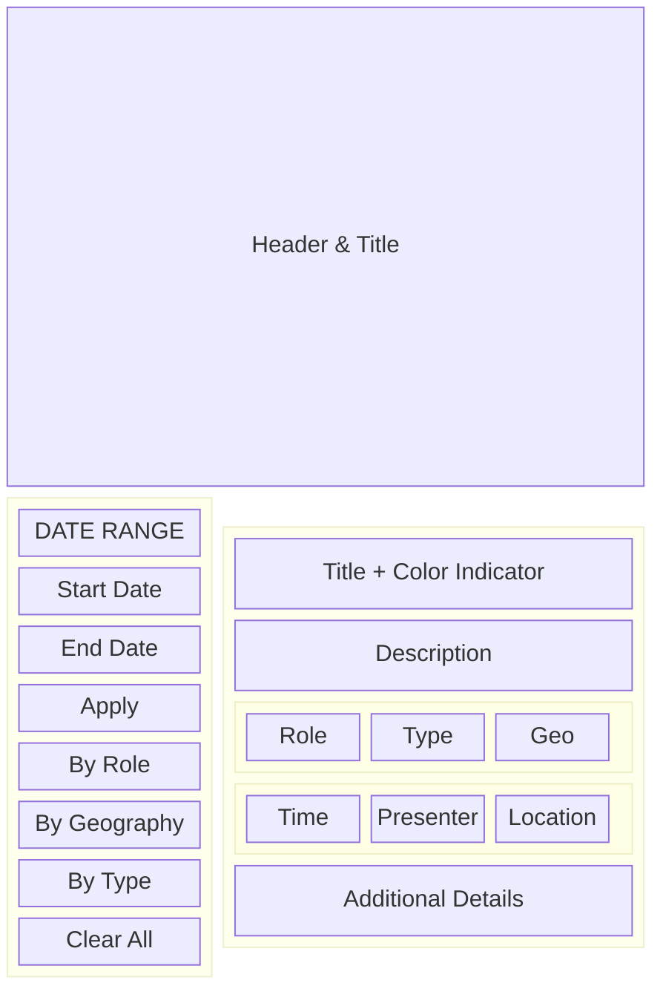

# 🌐 Public Agenda Implementation Guide

**File:** `public_page.md`  
**Purpose:** Complete documentation of how the public `/api/x_snc_ai_learnin_4/public_agenda/view` endpoint was implemented with date range filtering

---

## 🎯 **WORKING SOLUTION OVERVIEW**

**Public URL:** `https://<your-instance>.service-now.com/api/x_snc_ai_learnin_4/public_agenda/view`

**Key Achievement:** A fully functional public agenda page that requires **NO authentication** and displays real database data with professional styling, dynamic filtering, and **server-side date range filtering**.

---

## 🏗️ **ARCHITECTURE APPROACH**

### **Why REST API + HTML Response (Not Service Portal)**

**❌ Service Portal Challenges:**
- Complex manual setup required through UI
- Authentication issues with anonymous access
- Widget dependencies and iframe restrictions
- Difficult to troubleshoot and debug

**✅ REST API + HTML Solution:**
- **Complete control** over the entire page
- **True public access** with `authorization: false`
- **Self-contained** - single endpoint returns complete HTML page
- **Professional styling** with embedded CSS and JavaScript
- **Real-time database queries** with dynamic filtering
- **Server-side date range filtering** with proper query optimization

---

## 📁 **FILE STRUCTURE IMPLEMENTED**

```
src/
├── fluent/
│   ├── scripted-rest-apis/
│   │   ├── public_agenda.now.ts          # REST API definition
│   │   └── public_agenda.now.ts.backup   # Golden checkpoint backup
│   ├── acls/
│   │   ├── ai_sessions_acls.now.ts       # Table access permissions
│   │   └── ui_page_public_access.now.ts  # Public access ACLs
│   └── records/
│       └── public_page.now.ts            # sys_properties for public access
└── server/
    └── rest-api/
        ├── public_agenda_script.js       # Complete HTML page + date filtering
        └── public_agenda_script.js.backup # Golden checkpoint backup
```

---

## 🔧 **KEY IMPLEMENTATION COMPONENTS**

### **1. Scripted REST API Configuration**

**File:** `src/fluent/scripted-rest-apis/public_agenda.now.ts`

```typescript
import '@servicenow/sdk/global'
import { RestApi } from '@servicenow/sdk/core'

RestApi({
    $id: Now.ID['public_agenda_api'],
    name: 'Public AI Agenda API',
    serviceId: 'public_agenda',
    routes: [{
        $id: Now.ID['public_agenda_route'],
        path: '/view',
        method: 'GET',
        authorization: false,  // 🔑 CRITICAL: Allows anonymous access
        authentication: false,
        script: Now.include('../../server/rest-api/public_agenda_script.js')
    }]
})
```

**Key Settings:**
- ✅ `authorization: false` - Enables public access without authentication
- ✅ `serviceId: 'public_agenda'` - Creates clean URL structure
- ✅ Single GET resource for simple access

### **2. Complete HTML Page Generation with Date Range Filtering**

**File:** `src/server/rest-api/public_agenda_script.js`

**Architecture:** Single JavaScript file that:
1. **Processes Optional Date Range Parameters**
   - `start_date` and `end_date` query parameters in YYYY-MM-DD format
   - Defaults to current week when no parameters provided
   - Server-side filtering for optimal performance

2. **Queries Real Database Data with Date Filtering**
   - `x_snc_ai_learnin_4_ai_sessions` - Main sessions table with date range queries
   - `x_snc_ai_learnin_4_role_choices` - Role definitions  
   - `sys_choice` - Dynamic dropdown options
   - **Optimized queries**: Only returns sessions that START within date range

3. **Generates Complete HTML Page**
   - Embedded CSS for professional styling including date input styling
   - Embedded JavaScript for client-side filtering logic
   - Responsive two-column layout with stacked date inputs
   - Pre-populated date inputs showing current filter state

### **3. Date Range Implementation Details**

**Server-Side Date Processing:**
```javascript
// Get optional date range parameters
var startDate = request.queryParams.start_date;
var endDate = request.queryParams.end_date;

// Calculate current week as default (SCOPED APPLICATION COMPATIBLE)
var now = new GlideDateTime();
var currentDay = now.getDayOfWeekUTC(); // Note: UTC version for scoped apps
var weekStart = new GlideDateTime();
weekStart.addDaysUTC(-(currentDay - 1)); // Note: UTC version for scoped apps

// Convert user dates to proper datetime ranges
if (startDate) {
    var startGDT = new GlideDateTime();
    startGDT.setDisplayValue(startDate + ' 00:00:00'); // Beginning of day
    queryStartDate = startGDT.getValue();
}

// Filter sessions that START within the date range
gr.addQuery('start_time', '>=', queryStartDate);
gr.addQuery('start_time', '<=', queryEndDate);
```

**Client-Side Date Handling:**
```javascript
// Apply date filter with proper URL parameter handling
function applyDateFilter() {
    const startDate = document.getElementById("startDateFilter").value;
    const endDate = document.getElementById("endDateFilter").value;
    if (!startDate || !endDate) {
        alert("Please select both start and end dates");
        return;
    }
    const currentUrl = new URL(window.location);
    currentUrl.searchParams.set("start_date", startDate);
    currentUrl.searchParams.set("end_date", endDate);
    window.location.href = currentUrl.toString();
}
```

### **4. Access Control Lists (ACLs)**

**File:** `src/fluent/acls/ai_sessions_acls.now.ts`

```typescript
// Allow public read access to ai_sessions table
export const ai_sessions_public_read_acl = Acl({
    $id: Now.ID['ai-sessions-public-read'],
    name: 'x_snc_ai_learnin_4_ai_sessions',
    type: 'record',
    operation: 'read',
    condition: 'gs.hasRole("public")',  // 🔑 Public role access
    script: '',
    active: true
})
```

### **5. Professional Frontend Design with Date Range UI**

**Layout Architecture:**


**Date Input Styling:**
- ✅ **Stacked layout** (not side-by-side) to fit 300px filter panel
- ✅ **System font override** to eliminate "terminal style" monospace appearance
- ✅ **Consistent styling** with other form elements
- ✅ **Responsive design** with proper mobile support

---

## 🔧 **CRITICAL SUCCESS FACTORS & LESSONS LEARNED**

### **1. Public Access Configuration**
- **REST API:** `authorization: false` and `authentication: false` in Fluent definition
- **ACLs:** `gs.hasRole("public")` conditions for data access
- **No authentication required** - truly anonymous access

### **2. Scoped Application Date/Time Restrictions** ⚠️

**CRITICAL LESSON:** Scoped applications have strict restrictions on GlideDateTime methods.

**❌ FORBIDDEN in Scoped Apps:**
```javascript
var day = gdt.getDayOfWeek();        // ❌ Not allowed
gdt.addDays(7);                      // ❌ Not allowed  
gdt.setTime(0, 0, 0, 0);            // ❌ Not allowed
```

**✅ REQUIRED in Scoped Apps:**
```javascript
var day = gdt.getDayOfWeekUTC();     // ✅ UTC version required
gdt.addDaysUTC(7);                   // ✅ UTC version required
// setTime() not available - use alternative approaches
var dateOnly = gdt.getDate().getValue(); // ✅ Get date portion only
```

**Impact:** Had to completely rewrite date calculation logic three times to comply with scoped application restrictions.

### **3. Date Format Handling Between Client and Server**

**Challenge:** HTML date inputs send YYYY-MM-DD format, but GlideRecord queries need proper datetime objects.

**Solution:**
```javascript
// Convert client date to server datetime range
if (startDate) {
    var startGDT = new GlideDateTime();
    startGDT.setDisplayValue(startDate + ' 00:00:00');  // Beginning of day
    queryStartDate = startGDT.getValue();
}
if (endDate) {
    var endGDT = new GlideDateTime();
    endGDT.setDisplayValue(endDate + ' 23:59:59');     // End of day
    queryEndDate = endGDT.getValue();
}
```

### **4. UI/UX Design Considerations**

**Font Issues:** Date inputs often inherit browser monospace fonts.
**Solution:** Explicit font override:
```css
input[type="date"] {
    font-family: system-ui, sans-serif;
    font-size: 1rem;
}
```

**Layout Issues:** Side-by-side date inputs overflow in 300px panel.
**Solution:** Vertical stacking:
```css
.date-range-group {
    display: grid;
    grid-template-columns: 1fr; /* Single column, not 1fr 1fr */
    gap: 0.5rem;
}
```

### **5. Server-Side vs Client-Side Filtering**

**Architecture Decision:** Date filtering is server-side, other filters are client-side.

**Benefits:**
- ✅ **Performance:** Only relevant sessions loaded from database
- ✅ **Accuracy:** Proper datetime comparisons on server
- ✅ **User Experience:** Page reload shows filtered state in URL
- ✅ **Bookmarkable:** Users can bookmark specific date ranges

### **6. Single-File Architecture**
- **Complete HTML page** generated from one REST endpoint
- **Embedded CSS and JavaScript** - no external dependencies
- **Self-contained solution** - no iframe or widget complications

### **7. Real Database Integration**
- **Dynamic queries** to actual ServiceNow tables with date filtering
- **No hardcoded data** - everything from database
- **Live filtering** based on real choice field values and date ranges

---

## 🚀 **DEPLOYMENT PROCESS & GOLDEN CHECKPOINTS**

### **Golden Checkpoint Strategy:**
```bash
# Always create backups before major changes
cp src/server/rest-api/public_agenda_script.js src/server/rest-api/public_agenda_script.js.backup
cp src/fluent/scripted-rest-apis/public_agenda.now.ts src/fluent/scripted-rest-apis/public_agenda.now.ts.backup
```

### **Build and Install Commands:**
```bash
# Build the application
npm run build

# Install to ServiceNow instance  
npm run install
```

### **Testing Strategy:**
1. ✅ **Test basic URL:** `/api/x_snc_ai_learnin_4/public_agenda/view` (should show current week)
2. ✅ **Test date parameters:** `?start_date=2026-04-01&end_date=2026-04-10`
3. ✅ **Test date UI:** Select dates and click "Apply Date Filter"
4. ✅ **Test other filters:** Verify role/geography/type filters still work
5. ✅ **Test clear functionality:** "Clear Date Range" button

---

## 🎯 **API USAGE EXAMPLES**

### **Default (Current Week):**
```
GET /api/x_snc_ai_learnin_4/public_agenda/view
```
Returns sessions starting in the current week (Sunday to Saturday).

### **Custom Date Range:**
```
GET /api/x_snc_ai_learnin_4/public_agenda/view?start_date=2026-04-01&end_date=2026-04-10
```
Returns sessions starting between April 1st and April 10th, 2026.

### **Query Parameter Format:**
- `start_date`: YYYY-MM-DD format (e.g., "2026-04-01")
- `end_date`: YYYY-MM-DD format (e.g., "2026-04-10")
- Both parameters are optional
- If only one is provided, the other defaults to current week boundary

---

## 🎯 **LESSONS LEARNED & BEST PRACTICES**

### **✅ DO:**
- Use REST API with HTML response for public pages with complex filtering
- Set `authorization: false` AND `authentication: false` for true public access
- Create golden checkpoints (backups) before major changes
- Use UTC date/time methods in scoped applications
- Convert client date formats to proper server datetime ranges
- Stack date inputs vertically in narrow panels
- Override browser default fonts on date inputs
- Query database dynamically with proper date filtering
- Create comprehensive ACLs for public data access
- Test with both default and custom date ranges

### **❌ DON'T:**
- Use Service Portal for anonymous/public access (too complex)
- Use non-UTC GlideDateTime methods in scoped applications
- Assume client date formats work directly in server queries  
- Place side-by-side date inputs in narrow (300px) panels
- Skip font styling on HTML date inputs (they look like terminal fonts)
- Create duplicate UI form elements (update existing ones instead)
- Hardcode filter options (query sys_choice table)
- Rely on iframe solutions for public pages
- Skip ACL configuration for public data access
- Deploy without golden checkpoints for complex changes

### **🔥 CRITICAL SCOPED APPLICATION GOTCHAS:**
1. **`getDayOfWeek()`** → Must use **`getDayOfWeekUTC()`**
2. **`addDays()`** → Must use **`addDaysUTC()`**
3. **`setTime()`** → **Not available at all** - find alternative approaches
4. **Always check scoped app documentation** for method restrictions
5. **Test in actual scoped environment** - global scope behaves differently

---

## 🔗 **WORKING URLS**

- **Public Agenda (Default):** `https://<your-instance>.service-now.com/api/x_snc_ai_learnin_4/public_agenda/view`
- **Public Agenda (Date Filtered):** `https://<your-instance>.service-now.com/api/x_snc_ai_learnin_4/public_agenda/view?start_date=2026-04-01&end_date=2026-04-10`
- **Admin UI Page:** `https://<your-instance>.service-now.com/x_snc_ai_learnin_4_agenda.do`
- **Sessions Table:** `https://<your-instance>.service-now.com/x_snc_ai_learnin_4_ai_sessions_list.do`

---

**🏆 Result:** A production-ready public agenda page with server-side date range filtering that requires zero authentication, provides professional user experience with real database integration, and handles scoped application restrictions properly.**
