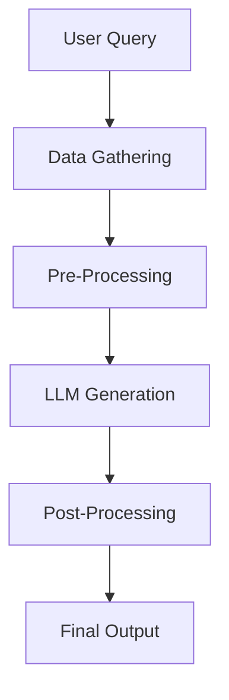
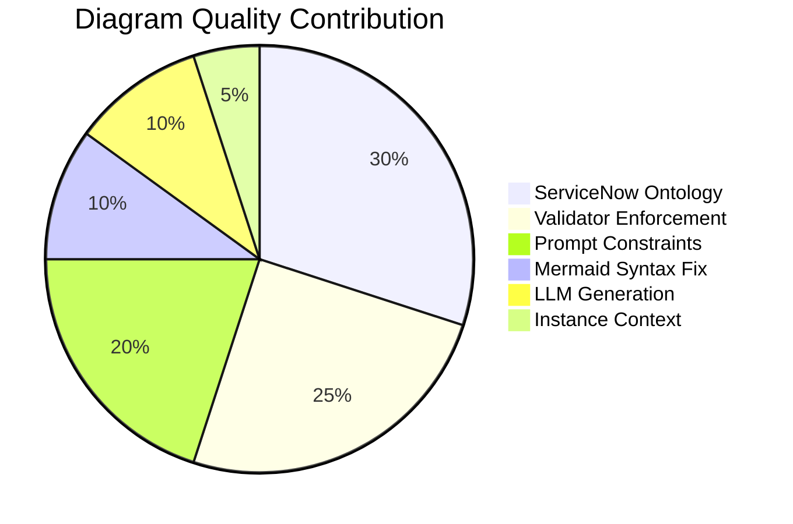
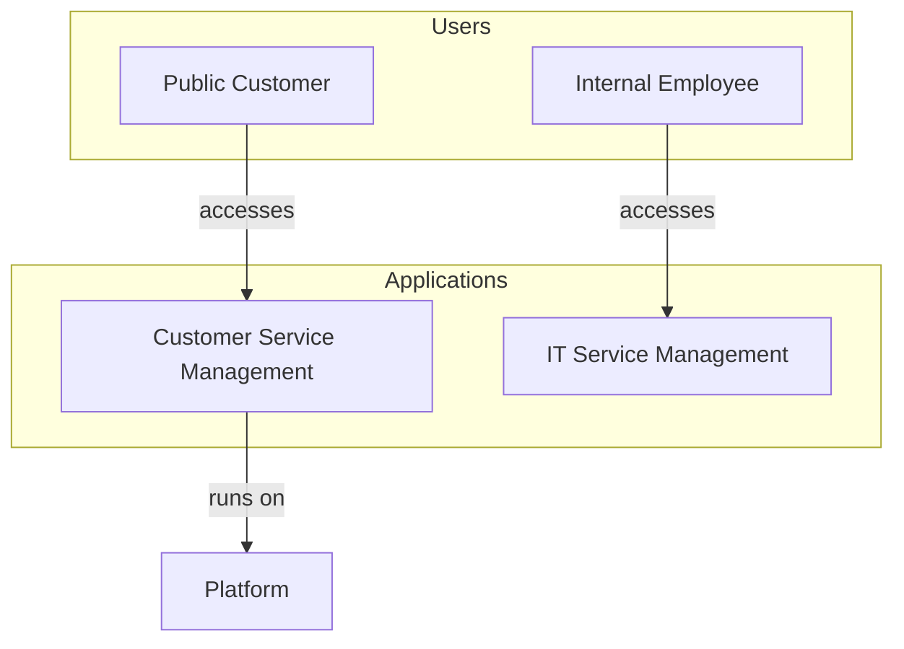

# Project Virgil - ServiceNow Architecture & Pricing Intelligence

A presales intelligence platform for ServiceNow with three engines:

- **Virgil** (Architecture Chat) - LLM-powered architecture analysis, diagram generation, and solution recommendations from instance data, uploaded documents, and ontology constraints
- **Minos** (Instance Assessment) - Deterministic 53-rule engine that scans a live instance and produces IT4IT gap analysis, findings, and architecture diagrams with zero LLM dependency
- **Plutus** (WDF Credit Sizing) - Auto-detects Workflow Data Fabric capability usage, annualizes from execution logs, calculates credit consumption, and exports to Excel

---

## 🚀 Quick Start with Docker (Recommended)

The easiest way to run this application is using Docker. No need to install Python, Node.js, or Java manually.

### Step 1: Install Docker Desktop

Docker Desktop is the only prerequisite you need.

#### Windows
1. Download [Docker Desktop for Windows](https://desktop.docker.com/win/main/amd64/Docker%20Desktop%20Installer.exe)
2. Run the installer
3. Follow the installation wizard
4. Restart your computer when prompted
5. Launch Docker Desktop from the Start menu
6. Wait for Docker to start (whale icon in system tray)

**Requirements:** Windows 10 64-bit (Pro, Enterprise, or Education) or Windows 11

#### macOS
1. Download [Docker Desktop for Mac](https://desktop.docker.com/mac/main/amd64/Docker.dmg)
   - For Apple Silicon (M1/M2/M3): Use the same link (universal binary)
   - For Intel Macs: Use the same link
2. Open the downloaded `.dmg` file
3. Drag Docker icon to Applications folder
4. Launch Docker from Applications
5. Grant permissions when prompted
6. Wait for Docker to start (whale icon in menu bar)

**Requirements:** macOS 11 or newer

#### Linux
```bash
# Ubuntu/Debian
curl -fsSL https://get.docker.com -o get-docker.sh
sudo sh get-docker.sh
sudo usermod -aG docker $USER
newgrp docker

# Verify installation
docker --version
docker-compose --version
```

**Verify Docker is Running:**
```bash
docker --version
# Should output: Docker version 24.x.x or higher
```

### Step 2: Get Your API Keys

You need at least one LLM API key:

- **OpenAI:** Get API key at [platform.openai.com/api-keys](https://platform.openai.com/api-keys)
- **Anthropic:** Get API key at [console.anthropic.com](https://console.anthropic.com)
- **Google Gemini:** Get API key at [aistudio.google.com/app/apikey](https://aistudio.google.com/app/apikey)

### Step 3: Run with Docker Compose

1. **Clone the repository:**
   ```bash
   git clone https://github.com/leojacinto/project-virgil.git
   cd project-virgil
   ```

2. **Create environment file:**
   ```bash
   cp .env.example .env
   ```
   
3. **Edit `.env` and add your API key:**
   ```bash
   # At least one LLM API key required
   OPENAI_API_KEY=your_openai_api_key_here
   # OR
   ANTHROPIC_API_KEY=your_anthropic_api_key_here
   # OR
   GOOGLE_API_KEY=your_google_api_key_here
   ```

4. **(Optional) Download and place ServiceNow JDBC driver:**
   
   > **Note:** JDBC is only needed if you select **REST API + JDBC** mode during setup. If you use **REST API Only** mode (the default), skip this step entirely. No JDBC driver or Java required.
   
   Download the driver from:
   - Your ServiceNow instance's JDBC driver download page
   - ServiceNow Store
   - Contact your ServiceNow administrator
   
   Then place it in the jdbc directory:
   ```bash
   mkdir -p backend/jdbc
   cp /path/to/your-downloaded-jdbc-driver.jar backend/jdbc/ServiceNowJdbc-1.0.3-SNAPSHOT.jar
   ```

5. **Start the application:**
   ```bash
   docker-compose up -d
   ```
   
   This will automatically pull the images from Docker Hub:
   - `leofrancia08489/project-virgil-backend:v1.8.0`
   - `leofrancia08489/project-virgil-frontend:v1.8.0`

6. **Open your browser:**
   - Frontend: http://localhost:3000
   - Backend API: http://localhost:8000

7. **Stop the application:**
   ```bash
   docker-compose down
   ```

That's it! No Python, Node.js, or Java installation required. Docker handles everything.

---

## 📦 Latest Release: v1.8.0 (March 2026)

### v1.8.0 | ServiceNow Native App

The entire Virgil backend — Minos scanner, Plutus credit sizing, ontology graph, and rule engine — has been ported to native ServiceNow Script Includes running inside a scoped application (`x_snc_virgil`). No external server, no Docker, no Python required.

- ✅ **7 Script Includes** deployed: MinosScanner, PlutusScanner, MinosOntology, MinosRuleEngine, VirgilUtils, VirgilAjax, PlutusRateCard
- ✅ **4 Scripted REST API endpoints**: Minos scan/history, Plutus scan/history
- ✅ **8 custom tables** with seed data: scans, findings, rate card, rules, ontology nodes/edges
- ✅ **`deploy.py`**: single-command deployment via REST API (tables, fields, scripts, seed data, menu)
- ✅ **Build Agent prompt** (`BUILD_AGENT_PROMPT.md`): full spec for generating workspace UI pages
- ✅ **9 lessons learned** from porting to ServiceNow (see [CHANGELOG.md](CHANGELOG.md))

**Docker Hub Images (React/FastAPI version):**
- Backend: `leofrancia08489/project-virgil-backend:v1.8.0`
- Frontend: `leofrancia08489/project-virgil-frontend:v1.8.0`

> 📋 **Full changelog**: [CHANGELOG.md](CHANGELOG.md)

---

## Three Engines

Project Virgil is a presales intelligence platform with three distinct engines, two of which are fully deterministic (no LLM required).

### Minos - Instance Assessment (No LLM)

Minos scans a live ServiceNow instance via REST API and evaluates it against 45 deterministic rules. Every recommendation cites specific instance conditions — not generic best practice.

**Pipeline:** REST API Scan → InstanceModel → Ontology Mapping → Rule Engine (45 rules) → Findings + Recommended Nodes → Mermaid Diagrams → Gap Analysis

**What it produces:**
- **IT4IT Coverage**: Gap analysis across 4 value streams (S2P, R2D, R2F, D2C) with per-stream health status
- **Findings**: Each finding includes severity, evidence dict with actual instance values, condition that triggered it, and a specific recommendation
- **Architecture Diagrams**: As-is (what you have) and Recommended (what you should add) — both generated deterministically from the ontology graph
- **Integration Analysis**: REST vs SOAP patterns, MID Server presence, Flow Designer utilization
- **Health Checks**: CMDB without Discovery, customer portal anti-patterns, custom table sprawl, shelfware detection
- **Security Posture**: SecOps coverage for sensitive data instances

**Rule categories (45 rules across 6 categories):**

| Category | Rules | Source |
|----------|-------|--------|
| IT4IT v3 Coverage | IT4IT value stream gap detection | Ian Leu |
| Integration Patterns | REST/SOAP, MID Server, Flow Designer | Jochen Geist |
| Architectural Health | CMDB, Discovery, portals, legacy workflows | Best practices |
| Product Adoption Maturity | 9 module-pairing checks (e.g. ITSM+KB, CSM+Portal) | Best practices |
| Security Architecture | SecOps coverage for sensitive data instances | Best practices |
| Platform Efficiency | Shelfware detection, Flow Designer underutilization | Best practices |

**Key design principle:** Every finding says *"you should have X because your instance has ABC conditions"* — not *"you should have X because a document says so."*

**API:** `POST /api/assess`

---

### Plutus - WDF Credit Sizing (No LLM)

Plutus scans execution logs to auto-detect which Workflow Data Fabric capabilities are in use, estimates annualized usage, and calculates credit consumption against the WDF v2 rate card.

**Pipeline:** Minos Scan (reused) → Execution Log Queries → Auto-Detection → Data Span Detection → Annualization → Credit Calculation → Excel Export

**What it produces:**
- **Auto-detection** of 7 WDF capabilities from execution data:
  - Integration Hub (outbound HTTP log count)
  - Stream Connect (single-source high-frequency pattern)
  - Zero Copy Connectors SQL (JDBC data sources + REST messages to supported DBs)
  - AI Data Explorer (report + dashboard count)
  - RPA Bots (execution records)
  - API Access Volume (outbound HTTP volume)
  - External Content Connectors (manual)
- **Annualized usage** with two columns:
  - **Usage/Year** — actual data when >= 365 days of logs exist
  - **Usage/Year (Est.)** — extrapolated via average daily rate x 365 when < 365 days of data
- **Credit calculation** from annualized values against the rate card
- **Tier recommendation**: Standard (1 pack, $100k/yr) or Professional (4 packs, $400k/yr)
- **Excel export**: 3-sheet workbook (Usage Breakdown with summary cards, Rate Card, How Usage is Measured)

**Rate card management:**
- Editable capability labels, credits per unit, STD/PRO tier toggle
- Add/remove capabilities in the UI
- Persists to YAML and triggers re-scan

**Exclude/restore:** Dismiss detected capabilities from the estimate with one click; restore with original scan evidence preserved.

**Password protection:** Plutus requires a password on launch. The hashed password is stored in `backend/.plutus_key` (gitignored — never committed). To set or reset:
```bash
python3 backend/set_plutus_password.py
```
Anyone who clones the repo can read all code, but must create their own `.plutus_key` to execute Plutus.

**API:** `POST /api/plutus/scan`, `POST /api/plutus/recalculate`

---

### Virgil Chat - Architecture Analysis (Requires LLM)

Virgil Chat is the LLM-powered engine for free-form architecture queries. It combines instance data, uploaded documents, ontology constraints, and assessment findings to produce reasoned architectural recommendations with validated Mermaid diagrams.

**When to use it:** Complex, multi-constraint questions like *"What's the best architecture for CSM + ITSM for a public sector customer with a public-facing website, internal ITSM, and FedRAMP/SPP requirements — single or dual instance?"*

**What it adds over Minos:**
- Natural language synthesis of complex trade-offs
- Novel architecture composition beyond the fixed ontology
- RAG over uploaded documents (RFPs, SOWs, pricing sheets)
- Instance-specific reasoning that combines multiple findings into a coherent recommendation

### End-to-End Pipeline (Virgil Chat)

When a user submits a query, the system executes the following pipeline:



| Step | What Happens |
|------|-------------|
| **User Query** | Natural language request, e.g. *"CSM + ITSM architecture with customer portal"* |
| **Data Gathering** | Three parallel sources: **Instance Data** (REST API or JDBC: apps, tables, plugins), **Document Store** (dual RAG across SN Assets + Customer Docs, top-5 chunks), **Web Search** (optional external context) |
| **Pre-Processing** | Ontology constraints: query type detection, relevant subgraph with 1-hop expansion, allowed labels + 32 replacement rules, anti-patterns, reference diagram, hard limits (15 arrows, 10 nodes, 4 subgraphs) |
| **LLM Generation** | Two calls: **Baseline** (no constraints, comparison only) and **Guided** (all constraints applied, produces diagram + analysis text) |
| **Post-Processing** | **Syntax Sanitizer** (character cleanup, format correction) then **Ontology Validator** (removes invalid arrows, replaces vague labels, prunes excess connections, detects circular deps) |
| **Final Output** | Corrected Mermaid diagram, analysis + recommendations, gap analysis, full pipeline log |

> **Key insight:** The diagram is ~90% shaped by the ontology, validator, and hard limits. The LLM does ~10% of the diagram quality work. The analysis text and recommendations, however, are ~90% LLM-driven, enriched by instance data and documents but not validated post-generation.

### Architecture Intelligence Stack

The system uses a constraint-based architecture where the LLM generates content within strict boundaries enforced by the ontology, constrained by hard prompt limits, and corrected post-generation by the validator.



| Layer | Weight | What It Does |
|-------|--------|-------------|
| **ServiceNow Ontology** | 30% | Graph-based knowledge model (40 nodes, 65 typed edges), query-aware subgraph extraction, table hierarchy, architecture layers, anti-patterns, reference example diagrams |
| **Validator Enforcement** | 25% | Post-generation correction that removes invalid arrows, applies 32 label replacements, prunes excess arrows by priority, and detects bidirectional and circular dependencies |
| **Prompt Constraints** | 20% | Hard limits injected into LLM prompt: max 15 arrows, 10 nodes, 4 subgraphs, 3 outgoing per node, label whitelist, orchestration layering rules |
| **Mermaid Syntax Fix** | 10% | Regex-based character cleanup, strips code blocks, fixes subgraph prefixes. Blocks 100% of rendering failures |
| **LLM Generation** | 10% | Gemini 2.5 Flash, GPT-4, or Claude. Baseline comparison, constrained generation, analysis text and recommendations |
| **Instance Context** | 5% | REST API apps and capabilities, JDBC tables, plugins, usage stats. Gap analysis fed into LLM prompt |

The core design principle: **LLMs need guardrails, not just prompts.** Left unconstrained, LLMs generate architecturally incorrect diagrams. Portal accessing CMDB directly, Knowledge Base depending on Incident, circular dependencies in foundational components, vague labels like "leverages" that encode no real meaning. Project Virgil constrains the LLM before generation (ontology rules + hard limits in prompt), corrects it after generation (validator removes invalid arrows, replaces vague labels, prunes excess connections), and sanitizes the output for rendering. The LLM does ~10% of the quality work. The guardrails do the rest.

The ontology is currently a custom-built graph model derived from ServiceNow's public platform documentation. The planned integration target is **ServiceNow's data.world**, acquired by ServiceNow in late 2024 to bring enterprise knowledge graph, data catalog, and metadata management natively into the Now Platform. Once data.world's ontology and knowledge graph APIs are available, Virgil's custom ontology will be replaced with a live connection to ServiceNow's native semantic layer, providing real-time table relationships, plugin dependencies, and instance-specific metadata without manual maintenance.

### Constraint-Based Architecture

The system doesn't rely on the LLM being "smart enough". Instead, it constrains the LLM to only generate valid outputs, and corrects the output when it doesn't comply.

Three-Layer Validation:

1. **Pre-Generation Constraints** (Ontology + Hard Limits in prompt)
   - Graph-based ontology rules injected into system prompt
   - Hard numerical limits: max 15 arrows, max 10 nodes, max 4 subgraphs
   - Query type detection applies specialized constraints (ITSM, CSM, compliance, etc.)
   - Layering rules: Users → Portals → Applications → Platform → Data

2. **Post-Generation Enforcement** (ArchitectureValidator)
   - Parses Mermaid node labels (not just IDs) for accurate matching
   - Checks each relationship against ontology anti-patterns
   - **Removes invalid arrows** from the diagram (not just warnings)
   - **Prunes excess arrows** by priority when over the 15-arrow limit
   - Detects bidirectional arrows and circular dependencies
   - Returns corrected diagram that replaces the original

3. **Syntax Auto-Fix** (Mermaid Sanitizer)
   - Removes `&`, `/`, `()` from subgraph names, edge labels, node labels
   - Strips markdown code blocks and numbered prefixes
   - Ensures diagram starts with `graph TD`
   - Blocks 100% of rendering failures

This approach shifts from "usually good" to "reliably good". The guardrails are the product, not the LLM.

### Why This is Better Than "ChatGPT + SN Utils + VSCode"

| Aspect | ChatGPT + Tools | Project Virgil |
|--------|----------------|----------------|
| **Architectural Validation** | ❌ No validation - can suggest impossible architectures | ✅ Three-layer enforcement: ontology constraints, validator correction, syntax auto-fix |
| **ServiceNow Knowledge** | ⚠️ Generic LLM knowledge (may be outdated) | ✅ Graph-based ontology (40 nodes, 65 edges) with table hierarchy, plugin mappings, and architecture layers |
| **Instance Awareness** | ❌ No connection to your instance | ✅ Queries live instance via REST API (apps, capabilities) + JDBC (relationships, plugins, usage stats) |
| **Diagram Quality** | ⚠️ Manual Mermaid editing required, syntax errors common | ✅ Auto-generated with hard limits (max 15 arrows), validated, corrected, and syntax-fixed |
| **Presales Context** | ❌ Generic recommendations | ✅ Gap analysis: "You have CSM with 1,234 cases, need Customer Portal for public access" |
| **Consistency** | ❌ Varies per prompt, no error prevention | ✅ Constraint-based architecture ensures reliable output every time |
| **Integration** | ❌ Copy-paste between tools | ✅ Unified workflow: query → constrained generation → validation → auto-fix → diagram |
| **Error Handling** | ❌ User must debug syntax errors | ✅ Automatic syntax correction + validation warnings in response |

### Key Differentiators

#### 1. ServiceNow Ontology (Graph-Based Knowledge Model)
- 40 Nodes: Products (ITSM, CSM, HRSD, ITOM, SecOps, GRC, SPM), modules, portals, platform, data, orchestration
- 65 Typed Edges: extends, depends_on, runs_on, references, creates, consumes, resolves_using, authenticates_via, segregated_from
- Table Hierarchy: Knows that incident, problem, change, case all extend the task table
- Plugin Mappings: Each node maps to actual ServiceNow plugin IDs (e.g., com.snc.incident, com.sn_customerservice)
- Architecture Layers: users → ui → application → orchestration → platform → data
- Graph Traversal: what_depends_on("cmdb") returns all 9 modules that reference CMDB

**Example:**
```
❌ ChatGPT might suggest: Portal → CMDB → Application
✅ Virgil enforces: Portal → Application → Platform → CMDB
```

#### 2. Instance-Aware Recommendations
- Queries your live ServiceNow instance via REST API
- Detects installed apps (ITSM, CSM, HRSD, ITOM, etc.)
- Provides gap analysis: "You already have X, just need Y"
- Presales-ready: "Single instance recommended because you have FedRAMP compliance"

Example Output:
```
CURRENT INSTANCE STATE:
- Instance: your-instance.service-now.com
- ITSM: Yes ✅
- CSM: Yes ✅
- Customer Portal: No ❌ (Gap identified)
⚠ INSTANCE TYPE WARNING: 25 of 102 apps (24%) are demo/test artifacts
⚠ DATA LIMITATION: Connected via REST API only

Recommendation: Enable Customer Portal module (already licensed)
  [ontology-validated] Components verified against ServiceNow ontology graph
```

#### 3. Automated Diagram Generation & Validation
- Generates Mermaid diagrams with semantic relationships
- Auto-fixes common syntax errors (line breaks, quoted subgraphs)
- Validates diagram structure before rendering
- Fallback diagrams if LLM fails

**Example:**


#### 4. Integrated Workflow
- Single interface for query → analysis → diagram → recommendations
- Document context: Upload pricing docs, RFPs, technical specs
- Web search: Optional external context
- Mermaid Diagrams: Interactive, validated diagrams rendered in browser

### Real-World Use Cases

#### Presales Scenario
Query: "CSM + ITSM for public sector with FedRAMP compliance"

Virgil's Response:
1. ✅ Detects your instance has ITSM + CSM installed
2. ✅ Recommends single instance (FedRAMP compliance)
3. ✅ Identifies gap: Need Customer Portal for public-facing requests
4. ✅ Generates architecture diagram with proper layering
5. ✅ Provides migration steps and cost implications

ChatGPT + Tools:
- ❌ Doesn't know what's installed in your instance
- ❌ Generic "you could use CSM" recommendation
- ❌ No gap analysis or presales context
- ❌ Manual diagram creation required

#### Technical Architecture Review
Query: "How should Knowledge Base integrate with Incident Management?"

Virgil's Response:
1. ✅ Ontology enforces: KB is consumed BY Incident (not vice versa)
2. ✅ Shows correct relationship: `Incident -->|resolves using| KB`
3. ✅ Validates against instance: Checks if KB is configured
4. ✅ Recommends integration patterns (embedded KB, search, etc.)

ChatGPT:
- ⚠️ Might suggest incorrect bidirectional relationship
- ❌ No validation against ServiceNow architecture rules
- ❌ Generic integration advice

## Features

**Deterministic Engines (No LLM):**
- Minos Instance Assessment: 48-rule YAML-driven engine covering IT4IT coverage, integration patterns (Tier 1 + Tier 2), architectural health, adoption maturity, security architecture, and platform efficiency
- Plutus WDF Credit Sizing: Auto-detect 7 WDF capabilities from execution logs, annualize usage, calculate credits, recommend tier, export to Excel
- Plutus Rate Card Editor: Add/remove capabilities, editable labels and credits, STD/PRO tier toggle, persist to YAML
- ServiceNow Ontology: Graph-based knowledge model (40 nodes, 65 edges) with table hierarchy, plugin mappings, and architecture layers
- Architecture Diagrams: As-is and Recommended diagrams generated deterministically from ontology + rule findings

**LLM-Powered (Virgil Chat):**
- Architecture Analysis: Gemini 2.5 Flash, GPT-4, or Claude with structured depth requirements, cross-domain guidance, and ontology constraints
- Instance-Aware Recommendations: Confidence tagging (rule-backed, ontology-validated, llm-generated) and post-validation against ontology graph
- Dual Document Store: ServiceNow Assets + Customer Documents with source-tagged RAG retrieval
- Auto-Fix & Enforcement: Syntax auto-fix, validator removes invalid arrows and prunes excess connections
- OneLLM Gateway: LangChain-compatible wrapper for ServiceNow OneLLM (Anthropic via Vertex AI proxy)

**Platform:**
- Flexible Connection: REST API Only (no JDBC/Java required) or REST API + JDBC for full RaptorDB access
- Excel Export: 3-sheet workbook from Plutus (Usage Breakdown, Rate Card, How Usage is Measured)
- PDF Export: One-click export of assessments and architecture analysis to multi-page A4 PDF
- Mermaid Download: Hover-to-reveal download on every diagram saves .mmd syntax file
- Dark Mode: Light/dark theme toggle with system preference detection
- Demo Instance Detection: Automatic flagging of demo/sandbox instances
- Modern Web UI: React-based interface with TailwindCSS styling

## Architecture

```
project-virgil/
├── backend/                 # FastAPI Python backend
│   ├── services/
│   │   ├── instance_scanner.py        # Minos: REST scan → InstanceModel → rule evaluation → diagrams
│   │   ├── instance_scanner_rules.py  # Minos: 48 deterministic rules + RuleEngine
│   │   ├── rules.yaml                 # Minos: rule definitions (IT4IT, integration, health, adoption, security, efficiency)
│   │   ├── plutus_scanner.py          # Plutus: WDF capability detection, annualization, credit calc
│   │   ├── plutus_pricing.yaml        # Plutus: rate card, tiers, pack definitions
│   │   ├── servicenow_ontology.py     # Shared: graph-based SN knowledge model (40 nodes, 65 edges)
│   │   ├── architecture_validator.py  # Virgil Chat: post-generation enforcement & diagram correction
│   │   ├── llm_service.py             # Virgil Chat: LLM integration + prompt constraints
│   │   ├── sn_utils_service.py        # Shared: SN Utils REST API client
│   │   ├── servicenow_connector.py    # Shared: RaptorDB JDBC connection
│   │   ├── document_processor.py      # Virgil Chat: dual document store (SN Assets + Customer Docs)
│   │   ├── diagram_generator.py       # Virgil Chat: diagram generation
│   │   └── web_search.py              # Virgil Chat: web search integration
│   ├── main.py             # FastAPI application (all API endpoints)
│   ├── config.py           # Configuration management
│   └── requirements.txt    # Python dependencies
├── frontend/
│   ├── src/
│   │   ├── components/
│   │   │   ├── InstanceInfo.js        # Minos: assessment UI, gap analysis, diagrams, findings
│   │   │   ├── PlutusPricing.js       # Plutus: usage table, rate card editor, Excel export
│   │   │   ├── ResultsDisplay.js      # Virgil Chat: analysis results, confidence badges
│   │   │   ├── RuleEditor.js          # Minos: YAML rule editor
│   │   │   └── ModeSelector.js        # Engine selection (Virgil/Minos/Plutus)
│   │   ├── utils/         # Shared utilities (exportUtils.js: PDF export, Mermaid download)
│   │   └── App.js         # Main application
│   └── package.json       # Node dependencies (includes xlsx for Excel export)
├── servicenow-app/          # ServiceNow native scoped app (x_snc_virgil)
│   ├── script_includes/
│   │   ├── MinosScanner.js          # Minos: instance scan → ontology → rules → findings → diagrams
│   │   ├── PlutusScanner.js         # Plutus: rate card → detection → annualization → credits
│   │   ├── MinosOntology.js         # 37-node ontology graph + Mermaid generation
│   │   ├── MinosRuleEngine.js       # 49 deterministic architecture rules
│   │   ├── VirgilUtils.js           # Platform utilities (record counts, table checks, CMDB)
│   │   ├── VirgilAjax.js            # Client-callable GlideAjax wrapper
│   │   └── PlutusRateCard.js        # WDF rate card loader
│   ├── rest_api/
│   │   └── operations/              # Scripted REST API handlers (minos/plutus scan + history)
│   ├── tables/                      # JSON table schema definitions (8 tables)
│   ├── data/                        # Seed data (rules, ontology, rate card)
│   ├── deploy.py                    # Single-command REST API deployment script
│   └── BUILD_AGENT_PROMPT.md        # Build Agent prompt for workspace UI generation
└── README.md
```

## ServiceNow Native App Deployment

The `servicenow-app/` directory contains a complete port of Virgil's Minos and Plutus engines as a ServiceNow scoped application. No external server required — everything runs natively on the Now Platform.

### Prerequisites

1. A ServiceNow instance (demo, developer, or production)
2. Admin access with `admin` role
3. Python 3.9+ (for running `deploy.py` only — not needed at runtime)

### Deployment Steps

1. **Create the scoped app via App Engine Studio** (cannot be automated):
   - Navigate to App Engine Studio on your instance
   - Create a new app with scope name `x_snc_virgil`
   - Do **not** attempt to create a workspace here — workspace creation via App Engine Studio, REST API, and Background Script all failed to produce a functioning `/now/virgil/` URL on demo instances. The workspace and UI pages will be generated by Build Agent in step 4.

2. **Set your scope picker** to `x_snc_virgil` (Virgil) in the ServiceNow UI — this ensures all deployed artifacts land in the correct scope.

3. **Run the deployment script:**
   ```bash
   cd servicenow-app
   python deploy.py --instance your-instance.service-now.com --user admin --password your_password
   ```
   This creates all 8 tables, deploys 7 Script Includes, sets up the REST API, inserts seed data (rules, ontology, rate card), and creates navigation menu items.

4. **Generate the workspace UI via Build Agent:**
   - Open ServiceNow Build Agent on your instance
   - Provide the contents of `BUILD_AGENT_PROMPT.md` as the prompt
   - Build Agent will create the workspace, pages (Home, Minos, Plutus), and wire them to the deployed backend via GlideAjax and GlideRecord

5. **Test the scan endpoints:**
   ```bash
   # Minos architecture scan
   curl -u admin:password -X POST https://your-instance.service-now.com/api/x_snc_virgil/virgil_api/minos/scan

   # Plutus credit scan
   curl -u admin:password -X POST https://your-instance.service-now.com/api/x_snc_virgil/virgil_api/plutus/scan
   ```

### Lessons Learned (Porting to ServiceNow)

These are hard-won discoveries from porting a Python/FastAPI application to native ServiceNow Script Includes:

1. **Scope creation must be done manually via App Engine Studio** — REST API and Background Script cannot create scoped apps. App Engine Studio can create the scope, but workspace creation failed across all methods (App Engine Studio, REST API, Background Script) on demo instances. The workspace and UI must be generated by Build Agent.
2. **Admin must have scope picker set to `x_snc_virgil`** when running `deploy.py` — without this, all artifacts land in global scope.
3. **`e.getMessage()` is blocked in scoped apps** — caught exceptions must use `e` (toString) instead. `GlidePluginManager.isActive()` can also throw scope access errors and needs try-catch.
4. **ACLs cannot be created via REST API** — requires `security_admin` role and manual configuration.
5. **`sys_app_module` DIRECT links use the `query` field, NOT `uri`** — the `uri` field is silently stripped by ServiceNow on PATCH.
6. **UI Builder event handlers cannot execute arbitrary client scripts** — the "EXECUTE" option is limited to "Save User Preference". GlideAjax, fetch(), and alert() all fail to fire from button click handlers in workspace pages.
7. **Demo instances have no execution log data** — Plutus auto-detection returns 0 findings on fresh instances. Use `user_overrides` in the POST body to test with injected values.
8. **Seed data requires a cache flush + retry** — newly created tables may not be queryable immediately. `deploy.py` includes `cache.do` flush and exponential backoff retry.
9. **Boolean fields must be set as strings** — `gr.setValue('detected', 'true')` not `gr.setValue('detected', true)`.
10. **Deploy backend first, then use Build Agent for the UI** — deploy all Script Includes, REST API, tables, and seed data via `deploy.py` first, then use ServiceNow Build Agent to generate workspace pages on top of the already-working backend. Build Agent can reference the deployed tables and GlideAjax endpoints directly. Trying to build the UI manually in UI Builder before the backend is solid leads to wasted effort.

---

## Manual Installation (Alternative to Docker)

If you prefer to run without Docker, follow these steps:

### Prerequisites

- Python 3.9.6 (tested and verified working version)
- Node.js 16+
- ServiceNow instance (any edition, RaptorDB not required)
- OpenAI API key, Anthropic API key, or Google Gemini API key
- **(Optional, for JDBC mode only):** Java (OpenJDK 17+) + ServiceNow JDBC driver
  ```bash
  brew install openjdk@17
  ```

### Installation Steps

### Backend Setup

1. Navigate to the backend directory:
```bash
cd backend
```

2. Create a virtual environment:
```bash
python -m venv venv
source venv/bin/activate  # On Windows: venv\Scripts\activate
```

3. Install dependencies:
```bash
pip install -r requirements.txt
```

4. Download and place the ServiceNow JDBC driver:
```bash
mkdir -p jdbc
# Download the JDBC driver from your ServiceNow instance or ServiceNow Store
# Then copy it to the jdbc/ directory
cp /path/to/your-downloaded-jdbc-driver.jar jdbc/ServiceNowJdbc-1.0.3-SNAPSHOT.jar
```

5. Create environment configuration:
```bash
cp .env.example .env
```

6. Edit `.env` and add your credentials:
```env
OPENAI_API_KEY=sk-...
# OR
ANTHROPIC_API_KEY=sk-ant-...

SERVICENOW_INSTANCE=your_instance_name
SERVICENOW_USERNAME=your_username
SERVICENOW_PASSWORD=your_password
SERVICENOW_JDBC_PATH=./jdbc/servicenow-jdbc.jar

# Optional: For web search
SERPAPI_KEY=your_serpapi_key
```

### Frontend Setup

1. Navigate to the frontend directory:
```bash
cd frontend
```

2. Install dependencies:
```bash
npm install
```

## Running the Application

### Start Backend Server

```bash
cd backend
source venv/bin/activate  # On Windows: venv\Scripts\activate
python main.py
```

The backend API will be available at `http://localhost:8000`

### Start Frontend Development Server

In a new terminal:

```bash
cd frontend
npm start
```

The frontend will be available at `http://localhost:3000`

## Usage

### 1. Connect to ServiceNow

- Open the application in your browser
- Enter your ServiceNow instance credentials
- Click "Connect to ServiceNow"
- Wait for the connection to be established

### 2. Upload Reference Documents (Optional)

- Navigate to the "Documents" tab
- Drag and drop or click to upload pricing documents, technical specs, etc.
- Documents will be processed and indexed for semantic search

### 3. Generate Architecture

- Navigate to the "Architecture Query" tab
- Enter your requirements (e.g., "How do I address a customer service workflow requirement?")
- Configure options:
  - Enable/disable web search
  - Enable/disable document search
- Click "Generate Architecture"

### 4. Review Results

- View the generated Mermaid architecture diagram
- Read the detailed analysis
- Review recommendations with ServiceNow components
- Copy diagram code for documentation

## Example Queries

- "How do I address a customer service workflow requirement?"
- "Architect a master data management solution that writes to SAP"
- "Design an ITSM solution with incident and change management"
- "Create an integration architecture for Salesforce and ServiceNow"
- "Build a knowledge management system with AI-powered search"

## API Endpoints

### Connection
- `POST /api/connect` - Connect to ServiceNow instance
- `GET /api/connection/status` - Check connection status

### ServiceNow Data
- `GET /api/servicenow/tables` - Get available tables
- `GET /api/servicenow/installed-apps` - Get installed applications
- `GET /api/servicenow/components` - Get components (workflows, business rules, etc.)

### Documents
- `POST /api/upload` - Upload document
- `GET /api/documents` - List uploaded documents
- `DELETE /api/documents/{file_id}` - Delete document

### Minos (Instance Assessment)
- `POST /api/assess` - Run deterministic instance assessment (45 rules, no LLM)
- `GET /api/assess/rules` - Get rule catalog and summary
- `GET /api/assess/knowledge-base` - Get structured knowledge base for all rule sources
- `GET /api/rules/yaml` - Get full YAML rule data for the editor
- `POST /api/rules/save` - Save modified rules and hot-reload

### Plutus (WDF Credit Sizing)
- `POST /api/plutus/scan` - Run WDF credit sizing scan (auto-detect capabilities, annualize, calculate credits)
- `POST /api/plutus/recalculate` - Recalculate credits with user overrides (preserves original scan evidence)
- `GET /api/plutus/config` - Get the full Plutus pricing YAML for the rate card editor
- `POST /api/plutus/config` - Save updated rate card to YAML

### Virgil Chat (Analysis)
- `POST /api/analyze` - Generate architecture analysis and diagram

### Diagrams
- `GET /api/diagrams/{diagram_id}` - Download generated diagram

### Health
- `GET /api/health` - Health check

## Configuration

### Backend Configuration (`backend/.env`)

| Variable | Description | Required |
|----------|-------------|----------|
| `OPENAI_API_KEY` | OpenAI API key for GPT-4 | Yes (or Anthropic) |
| `ANTHROPIC_API_KEY` | Anthropic API key for Claude | Yes (or OpenAI) |
| `SERVICENOW_INSTANCE` | ServiceNow instance name | Yes |
| `SERVICENOW_USERNAME` | ServiceNow username | Yes |
| `SERVICENOW_PASSWORD` | ServiceNow password | Yes |
| `SERVICENOW_JDBC_PATH` | Path to JDBC JAR file | Yes |
| `SERPAPI_KEY` | SerpAPI key for web search | No |
| `UPLOAD_DIR` | Document upload directory | No (default: ./uploads) |
| `DIAGRAM_OUTPUT_DIR` | Diagram output directory | No (default: ./diagrams) |
| `VECTOR_DB_PATH` | Vector database path | No (default: ./vectordb) |

## Troubleshooting

### JDBC Connection Issues

1. Ensure the ServiceNow JDBC JAR file is in the correct location
2. Verify your ServiceNow credentials are correct
3. Check that your instance allows JDBC connections
4. Ensure Java is installed and accessible
5. Ensure your public IP is allowlisted in your ServiceNow instance's IP Access Control List

### ServiceNow JDBC User Access Errors

If you see errors like `This user (jdbc.user.xxx) is not allowed access to table: sys_db_object`, your JDBC user needs the correct roles and ACLs in ServiceNow.

**Required Roles for the JDBC User:**

Assign the following roles to your JDBC user in ServiceNow (navigate to **User Administration > Users**, find the user, then go to the **Roles** tab):

| Role | Purpose |
|------|---------|
| `jdbc` | Required for all JDBC connectivity |
| `itil` | Read access to ITSM tables (incident, problem, change_request, task) |
| `catalog` | Read access to Service Catalog tables |
| `asset` | Read access to CMDB/asset tables |
| `personalize_dictionary` | Read access to sys_dictionary, sys_db_object (table metadata) |
| `admin` | **OR** grant this for full read access (simplest but broadest) |

**Tables Queried by Project Virgil:**

The application queries the following tables via JDBC. Your user needs at least **read** access to each:

| Table | Purpose | Minimum Role |
|-------|---------|-------------|
| `sys_db_object` | Table metadata discovery | `personalize_dictionary` |
| `sys_dictionary` | Table schema/column info | `personalize_dictionary` |
| `sys_app` | Installed applications | `admin` |
| `sys_plugins` | Active plugins | `admin` |
| `wf_workflow` | Workflows | `itil` or `workflow_admin` |
| `sys_script` | Business rules | `admin` |
| `cmdb_rel_type` | CMDB relationship types | `itil` or `asset` |
| `incident` | Incident records (row count) | `itil` |
| `task` | Task records (row count) | `itil` |
| `change_request` | Change records (row count) | `itil` |
| `problem` | Problem records (row count) | `itil` |
| `cmdb_ci` | CI records (row count) | `itil` or `asset` |
| `cmdb_ci_server` | Server CIs (row count) | `itil` or `asset` |
| `cmdb_ci_service` | Service CIs (row count) | `itil` or `asset` |
| `sn_customerservice_case` | CSM cases (row count) | `sn_customerservice_agent` |
| `customer_account` | Customer accounts (row count) | `sn_customerservice_agent` |
| `sys_user` | Users (row count) | `itil` |
| `sys_user_group` | Groups (row count) | `itil` |

**Recommended Approach (least privilege):**

1. Navigate to **User Administration > Users** in your ServiceNow instance
2. Find or create your JDBC user (e.g., `jdbc.user.leo`)
3. Go to the **Roles** tab and add: `jdbc`, `itil`, `personalize_dictionary`, `asset`
4. If you have CSM installed, also add: `sn_customerservice_agent`
5. For full metadata access (plugins, apps, business rules), add: `admin`

**Note:** The application gracefully handles access denials. If a table is inaccessible, it logs a warning and continues with available data. The LLM analysis will still work but with less instance context.

**If roles alone don't resolve the issue:**

ServiceNow may have custom ACLs that override role-based access. Check:
1. Navigate to **System Security > Access Control (ACL)**
2. Filter by the table name (e.g., `sys_db_object`)
3. Verify that the `read` operation ACL allows your user's roles
4. Check if there are any `before query` Business Rules restricting access

### LLM API Issues

1. Verify your API key is correct and active
2. Check API rate limits
3. Ensure you have sufficient API credits

### Document Upload Issues

1. Check file size (max 50MB)
2. Verify file format is supported (PDF, DOCX, XLSX, TXT, CSV)
3. Ensure sufficient disk space

## Technologies Used

### Backend
- FastAPI: Modern Python web framework
- JPype: Python-Java bridge for JDBC
- LangChain: LLM orchestration framework
- ChromaDB: Vector database for document search
- Sentence Transformers: Text embeddings
- Diagrams: Python diagram generation library

### Frontend
- React: UI framework
- TailwindCSS: Utility-first CSS framework
- Lucide React: Icon library
- Axios: HTTP client
- React Dropzone: File upload component
- Mermaid: Diagram rendering
- jsPDF + html2canvas: PDF export
- SheetJS (xlsx): Client-side Excel export for Plutus

## Security Considerations

**Current authentication model:**
- ServiceNow connections use **HTTP Basic Auth** over HTTPS. Credentials are sent per-request and held in memory only — they are not persisted to disk or logged.
- LLM API keys are stored in memory for the session duration. The `.env` file provides pre-fill convenience but is optional.

**Recommended practices:**
- **`.env` file**: Never commit to version control. The `.gitignore` already excludes it, but verify before pushing to shared repositories.
- **ServiceNow accounts**: Use a dedicated integration user with the minimum required roles (`itil`, `rest_service`, read access to relevant tables). Avoid using personal admin credentials in shared environments.
- **Network**: Run behind a reverse proxy with TLS termination in any environment beyond localhost. The backend binds to all interfaces by default.
- **LLM data exposure**: The document safety warning prompts before sending files to the LLM, but all query text, instance metadata, and document content are transmitted to the configured LLM provider. Verify your provider's data retention policy.

**Not yet supported (consider for production use):**
- **OAuth 2.0 / Token-based auth** for ServiceNow — currently Basic Auth only. ServiceNow supports OAuth; adding it would eliminate password storage entirely.
- **Application-level authentication** — the Virgil UI itself has no login. Anyone with network access to port 3000 can use it. Add a reverse proxy with SSO or basic auth if deploying beyond a local machine.
- **Rate limiting** — not implemented. Add at the reverse proxy layer if exposed to multiple users.
- **Audit logging** — API calls are logged at INFO level but there is no structured audit trail for who queried what.

## Knowledge Sources & Acknowledgments

Project Virgil's ontology and validation rules are built on curated, publicly documented ServiceNow architectural knowledge. The following resources and contributors have shaped the system's intelligence:

### ServiceNow IT4IT v3 Blueprint
- **Author:** [Ian Leu](https://www.linkedin.com/in/ian-leu)
- Maps the entire ServiceNow platform against the IT4IT reference architecture (S2P, R2D, R2F, D2C value streams)
- Provides product-to-value-stream mappings, CSDM alignment, and industry vertical extensions
- Used in the Instance Assessment rule engine for IT4IT coverage gap analysis

### ServiceNow Integration Pattern Decision Tree
- **Author:** [Jochen Geist](https://www.linkedin.com/in/jochengeist)
- **Reference:** [Integration Design: How to choose the best pattern to integrate ServiceNow with other systems](https://www.servicenow.com/community/architect-blog/integration-design-how-to-choose-the-best-pattern-to-integrate/ba-p/2874114)
- Deterministic decision tree (v3.1) covering 6 integration categories: Web Services, Data Persistence, Event-Driven Architecture, AI Agents (MCP/A2A), UI-Level Integrations, and Fallback Solutions
- Used in the Instance Assessment rule engine for integration pattern validation

### ServiceNow Platform Documentation
- Official ServiceNow product documentation, CSDM framework, and platform architecture guides
- ServiceNow Store spoke catalog for integration validation

## Roadmap

### Plutus Enhancements
- Pricing model comparison: compare WDF credit cost to existing ServiceNow licensing model (business case justification)
- Template-based sizing report generation from Plutus data (no LLM required)
- Historical trend tracking: store and compare scans over time

### Minos Enhancements
- Wave 3 rules: licensing cost estimation, upgrade readiness, performance anti-patterns
- IT4IT value stream scoring with maturity levels
- Integration pattern decision tree as a traversable graph in the validator
- Industry vertical rule packs (Banking/BIAN, Insurance/ACCORD, Telecom/TM Forum, Healthcare/HL7)

### data.world Integration
ServiceNow acquired [data.world](https://data.world) in late 2024, bringing enterprise knowledge graph, ontology management, and metadata catalog capabilities into the Now Platform. This is the natural evolution path for Project Virgil:
- Replace custom ontology with data.world's knowledge graph API for live table relationships, class hierarchy, and plugin dependencies
- Instance-specific metadata: actual customizations, business rules, and integration spokes from the catalog
- Eliminate manual ontology maintenance so the graph stays current with platform releases

### Platform
- Unit and integration test coverage
- Multi-user authentication
- Export to PlantUML, draw.io, and PowerPoint formats
- Diagram persistence and version history

## Authors

- **[Leo Francia](https://www.linkedin.com/in/leojmfrancia)**
- **[Robert Ninness](https://www.linkedin.com/in/rninne)**
- **[Claude](https://claude.ai)** — AI pair programmer (Anthropic). Co-developed backend services, ontology validation, analysis pipeline, and frontend components.

## License

MIT License

This software is provided free of charge and "as is", without warranty of any kind, express or implied, including but not limited to the warranties of merchantability, fitness for a particular purpose and noninfringement. In no event shall the authors or copyright holders be liable for any claim, damages or other liability, whether in an action of contract, tort or otherwise, arising from, out of or in connection with the software or the use or other dealings in the software.

### Important Notices

ServiceNow Licensing: This application connects to ServiceNow instances via RaptorDB. Use of ServiceNow requires appropriate licenses from ServiceNow, Inc. This application does not include or provide ServiceNow licenses. Users are responsible for ensuring they have proper authorization and licensing to access their ServiceNow instances.

Third-Party Services: This application integrates with third-party LLM services (OpenAI, Anthropic, Google, Azure). Users are responsible for their own API keys and compliance with the respective service providers' terms of service.

## Support

For issues or questions, please open an issue on GitHub or contact the authors.
